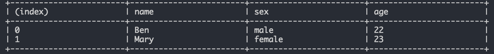
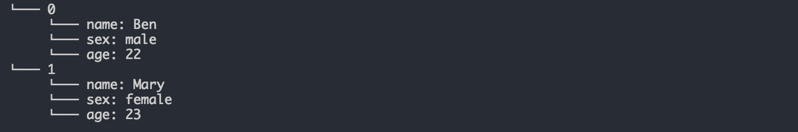

# Conshow 

## Introduction
A util help to output a log that can be updated, support styles such as table, progress, tree .etc

## Install
```
npm install conshow --save-dev
```

## Quick Start
```js
// index.js
const conshow = require('conshow');
conshow.log('test');

// output
test
```

#### if you want to update the log, please give it id.

```js
// index.js
const conshow = require('conshow');
conshow.log('test', { id: 'test' });
conshow.log('it is a update example');
conshow.log('update', { id: 'test' });

// output
update
it is a update example
```

## API
### out(String, option)
print a string without '\n'.
```js
conshow.out('test');
```
<div style="background: #333;color:#eee">test<span style="background: #eee;color: #eee">1</span></div>

### log(String, option)
print a string with '\n'.
```js
conshow.log('test');
```
<div style="background: #333;color:#eee;padding:0.3em;">test<br><span style="background: #eee;color: #eee">1</span></div>

### table(obj, option)
help to create a table
```js
conshow.table([
  { name: 'Ben', sex: 'male', age: 22 },
  { name: 'Mary', sex: 'female', age: 23 }
]);
```


### tree(obj, option)
help to create a tree
```js
conshow.tree([
  { name: 'Ben', sex: 'male', age: 22 },
  { name: 'Mary', sex: 'female', age: 23 }
]);
```



## Directives

### fontStyle
* @underline / @u
* @hide / @h
* @inverse / @i
* @clear / @c

### fontColor
* @black() / @b()
* @red() / @r()
* @green() / @g()
* @yellow / @y()
* @blue / @bl()
* @purple / @p()
* @darkgreen / @dg()

### backgroundColor
* @_black() / @_b()
* @_red() / @_r()
* @_green() / @_g()
* @_yellow / @_y()
* @_blue / @_bl()
* @_purple / @_p()
* @_darkgreen / @_dg()

### progress
* @progress()
  * option
    * `total`
    * `completeChar`
    * `loadChar`


### For example:

### @underline() / @u()
```js
conshow.log('@underline(test)');
```
<div style="background: #333;color:#eee;padding:0.3em;"><u>test</u><span style="background: #eee;color: #eee">1</span></div>


### @inverse() / @i()
```js
conshow.log('@inverse(test)');
```
<div style="background-color:#333; color: #eee;padding:0.3em;"><span style="background-color:#eee; color:#333">test</span><span style="background: #eee;color: #eee">1</span></div>

### @hide()
```js
conshow.log('@hide(test)');
```
<div style="background-color:#333; color: #eee;padding:0.3em;">&nbsp;&nbsp;&nbsp;&nbsp;&nbsp;&nbsp;&nbsp;&nbsp;<span style="background: #eee;color: #eee">1</span></div>

### @red()
```js
conshow.log('@red(test)');
```
<div style="background: #333;color:red;padding:0.3em;">test<span style="background: #eee;color: #eee">1</span></div>

### @progress(num)
```js
let i = 0;
const timer = setInterval(() => {
  f (i === 100) clearInterval(timer);
  conshow.log(`@i@g( test )\t@progress(${i}) ${i++}/100`, { id:'1' });
}, 10);
```
<div style="background: #333;color:#eee;padding:0.3em;"><span style="background:green;color:#333;">test</span>&nbsp;&nbsp;&nbsp;&nbsp;▓▓▓▓▓▓▓▓▓▓▓▓▓▓▓▓▓▓▓▓▓▓▓▓▓▓▓▓▓▓▓░░░░░░░░░░ 70/100<span style="background: #eee;color: #eee">1</span></div> 


```js
let i = 0;
const timer = setInterval(() => {
  if (i === 100) clearInterval(timer);
  conshow.log(`@i@g( test )\t[ @progress(${i}) ] ${i++}/100`, {
    id:'1',
    completeChar: '#',
    loadChar: ' ',
    total: 30,
  });
}, 10);
```
<div style="background: #333;color:#eee;padding:0.3em;"><span style="background:green;color:#333;">test</span>&nbsp;&nbsp;&nbsp;&nbsp; [ #########################&nbsp;&nbsp;&nbsp;&nbsp;&nbsp;&nbsp;&nbsp;&nbsp;&nbsp;&nbsp; ] 83/100<span style="background: #eee;color: #eee">1</span></div>

## LICENSE
MIT